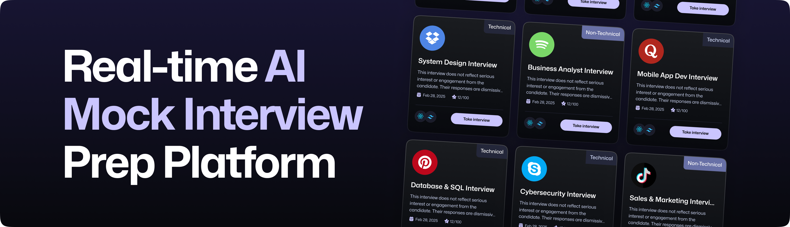

<div align="center">
  <br />
    <a href="https://ainterview-fv.vercel.app" target="_blank">
      
    </a>
  <br />

  <h3 align="center">Job interview preparation platform w/ Vapi AI Voice</h3>
</div>

## 📋 <a name="table">Table of Contents</a>

1. ✨ [Introduction](#introduction)
2. ⚙️ [Tech Stack](#tech-stack)
3. 📝 [Features](#features)
4. 🚀 [Quick Start](#quick-start)

## <a name="introduction">✨ Introduction</a>

**`[EN]`** Built with Next.js for the user interface and backend logic, Firebase for authentication and data storage, styled with TailwindCSS and using Vapi's voice agents, Prepwise is a website project designed to help you learn integrating AI models with your apps. The platform offers a sleek and modern experience for job interview preparation.

**`[FR]`** Développé avec Next.js pour l'interface utilisateur et la logique backend, Firebase pour l'authentification et le stockage des données, et stylisé avec TailwindCSS, Prepwise utilise les agents vocaux de Vapi pour offrir une expérience moderne et immersive de préparation aux entretiens d'embauche.

## <a name="tech-stack">⚙️ Tech Stack</a>

- [**Next.js**](https://nextjs.org/docs) is a React framework for building server-side rendered or statically exported applications. It enhances React by handling server-side rendering, automatic code splitting, and static site generation, improving performance, SEO, and user experience.

- [**Firebase**](https://firebase.google.com/docs) is a platform for building and managing apps, offering tools like authentication, real-time databases, hosting, and more. It provides a backend-as-a-service solution that simplifies app development and helps developers focus on building features.

- [**Tailwind CSS**](https://tailwindcss.com/docs) is a utility-first CSS framework for building custom designs without writing custom CSS. It allows for faster styling by using pre-defined classes, promoting consistency and scalability in the design process.

- [**Vapi AI**](https://vapi.ai/) provides AI-powered voice agents that can be integrated into applications for natural language processing and interaction. It enables developers to create intelligent, voice-enabled experiences with ease.

- [**shadcn/ui**](https://ui.shadcn.com/) is a library of accessible and customizable UI components designed to help developers create consistent, user-friendly interfaces. It focuses on simplicity, flexibility, and ease of use for modern web applications.

- [**Google Gemini**](https://ai.google.dev/) is an advanced AI model by Google designed to enhance natural language understanding and AI capabilities. It helps improve conversational AI, search, and other NLP-driven tasks across applications.

- [**Zod**](https://zod.dev/) is a TypeScript-first schema validation library that provides a simple and expressive way to define and validate data structures. Zod ensures data integrity by catching errors early during development.

## <a name="features">📝 Features</a>

👉 **Authentication**: Sign Up and Sign In using password/email authentication handled by Firebase.

👉 **Create Interviews**: Easily generate job interviews with help of Vapi voice assistants and Google Gemini.

👉 **Get feedback from AI**: Take the interview with AI voice agent, and receive instant feedback based on your conversation.

👉 **Modern UI/UX**: A sleek and user-friendly interface designed for a great experience.

👉 **Interview Page**: Conduct AI-driven interviews with real-time feedback and detailed transcripts.

👉 **Dashboard**: Manage and track all your interviews with easy navigation.

👉 **Responsiveness**: Fully responsive design that works seamlessly across devices.

and many more, including code architecture and reusability.

## <a name="quick-start">🚀 Quick Start</a>

Follow these steps to set up the project locally on your machine.

**Prerequisites**

Make sure you have the following installed on your machine:

- [Git](https://git-scm.com/)
- [Node.js](https://nodejs.org/en)
- [npm](https://www.npmjs.com/) (Node Package Manager)

**Cloning the Repository**

```bash
git clone {git remote URL}
```

**Installation**

Install the project dependencies using npm:

```bash
npm install
```

**Set Up Environment Variables**

Create a new file named `.env.local` in the root of your project and add the following content:

```env
NEXT_PUBLIC_VAPI_WEB_TOKEN=
NEXT_PUBLIC_VAPI_WORKFLOW_ID=

GOOGLE_GENERATIVE_AI_API_KEY=

NEXT_PUBLIC_BASE_URL=

NEXT_PUBLIC_FIREBASE_API_KEY=
NEXT_PUBLIC_FIREBASE_AUTH_DOMAIN=
NEXT_PUBLIC_FIREBASE_PROJECT_ID=
NEXT_PUBLIC_FIREBASE_STORAGE_BUCKET=
NEXT_PUBLIC_FIREBASE_MESSAGING_SENDER_ID=
NEXT_PUBLIC_FIREBASE_APP_ID=

FIREBASE_PROJECT_ID=
FIREBASE_CLIENT_EMAIL=
FIREBASE_PRIVATE_KEY=
```

Replace the placeholder values with your actual **[Firebase](https://firebase.google.com/)**, **[Vapi](https://vapi.ai/?utm_source=youtube&utm_medium=video&utm_campaign=jsmastery_recruitingpractice&utm_content=paid_partner&utm_term=recruitingpractice)** credentials.

**Running the Project**

```bash
npm run dev
```

Open [http://localhost:3000](http://localhost:3000) in your browser to view the project.
